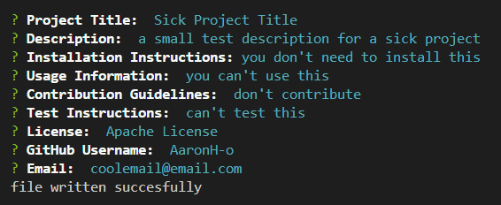

# README-generator
This is a README.md generator that creates a README file for your project. It is a command-line application that dynamically generates a professional README.md file from a user's input using the Inquirer package. The application will be invoked with the following command:

```bash
npm start
```

## Table of Contents
- [Installation](#installation)
- [Usage](#usage)

## Installation
To install the necessary dependencies, run the following command:

```bash
npm install
```

## Usage
This application is used to generate a README file for your project. It is a command-line application that dynamically generates a professional README.md file from a user's input using the Inquirer package.

## Screenshot
